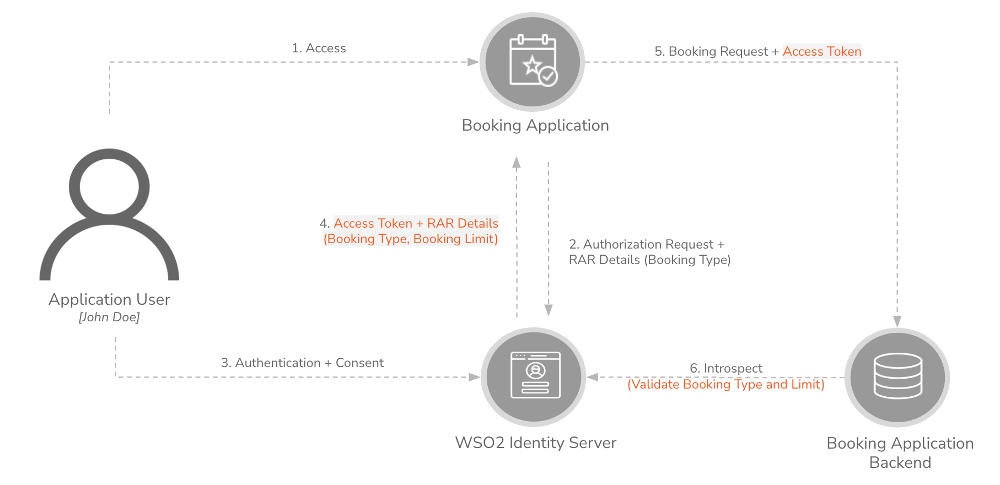

# Sample Application for Rich Authorization Requests (RAR) - Ticket Booking App

## Table of Contents
 1. [Overview](#overview)
 2. [Setup Guide](#setup-guide)
 3. [OAuth 2.0 Authorization Flow with RAR](#oauth-20-authorization-flow-with-rar)

## Overview

Rich Authorization Requests (RAR) is an OAuth 2.0 extension that enables clients to request fine-grained authorization by providing structured and detailed permission data. Instead of relying solely on simple scopes, RAR allows applications to define exactly what actions they need access to—such as transferring a specific amount of money or accessing a particular file. This enhances security and flexibility in authorization decisions, ensuring that permissions are granted based on precise requirements.

This Ticket Booking App serves as a practical example to showcase the Rich Authorization Requests (RAR) feature. It simulates a ticket booking system where users can reserve tickets for films and concerts based on their user type.

The system defines two user types with distinct permissions:
- **Silver Users**: Can book tickets exclusively for films, with a maximum limit of 50 USD per booking.
- **Gold Users**: Enjoy broader privileges, allowing them to book:
    - Film tickets up to 500 USD.
    - Concert tickets up to 1000 USD.

Unauthorized users are restricted from booking any tickets, ensuring access control based on defined authorization policies.

## Setup Guide

### Prerequisites

Before proceeding with the setup, ensure that the following components are configured with WSO2 Identity Server:

- [Authorization Processor (Extension)](https://github.com/wso2/samples-is/blob/master/rar-samples/ticket-booking-app/authorization-processor/README.md): Handles the authorization logic for the Ticket Booking App.
- [Frontend of Ticket Booking App](https://github.com/wso2/samples-is/blob/master/rar-samples/ticket-booking-app/frontend/README.md): The user interface for booking tickets.
- [Backend of Ticket Booking App](https://github.com/wso2/samples-is/blob/master/rar-samples/ticket-booking-app/backend/README.md): The server-side logic that processes ticket booking requests.

### Creating Test Users in WSO2 Identity Server

To set up the required test users, follow these steps:

1. Navigate to the **User Management** section in WSO2 Identity Server.
2. Go to **Users** and click on **Add User**.
3. Create the following three users:
    - A user with no `Account Type` specified.
    - A user with `Account Type` set to **Gold**.
    - A user with `Account Type` set to **Silver**.

These users will be used to test the different authorization scenarios in the Ticket Booking App.

### Try Out the Sample

Verify the behavior of the Ticket Booking App based on user account types:

- **Unauthorized Users**: Ensure that users without an account type cannot book tickets for either `Films` or `Concerts`.
- **Gold Users**: Confirm that Gold users can:
    - Book film tickets up to a maximum of 500 USD.
    - Book concert tickets up to a maximum of 1000 USD.
- **Silver Users**: Validate that Silver users can:
    - Book film tickets up to a maximum of 50 USD.
    - Cannot book tickets for concerts.

## OAuth 2.0 Authorization Flow with RAR

This section explains the OAuth 2.0 authorization flow for the Ticket Booking Application, utilizing Rich Authorization Requests (RAR).

1. **Initiating the Request**:  
    John Doe accesses the Ticket Booking Application and starts a ticket booking request. The application sends an authorization request to WSO2 Identity Server, including RAR details that specify the booking type (e.g., film or concert).

2. **Authentication and Consent**:  
    WSO2 Identity Server authenticates John and displays a consent screen. Upon John’s approval, the server grants access by issuing an access token containing the authorized RAR details, such as the booking type and spending limit.

3. **Submitting the Booking**:  
    John submits the ticket booking request to the application backend, attaching the access token.

4. **Validation and Authorization**:  
    The backend validates the access token with WSO2 Identity Server to ensure the booking type is permitted and the amount is within the user’s allowed limit.

5. **Final Decision**:  
    Based on the validation results, the backend either approves or denies the booking request.

This flow ensures secure and fine-grained authorization, allowing the application to enforce precise access controls based on user permissions.
