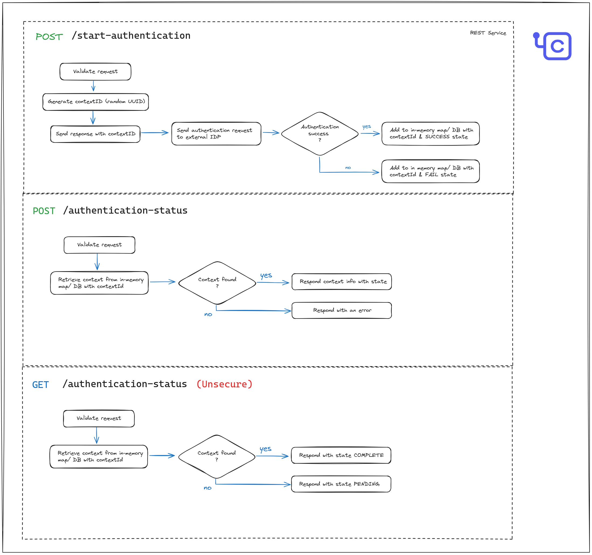

# External Authentication Service

## Introduction

On-demand silent password migration enables the seamless migration of user passwords from the legacy system to WSO2 Identity Server during login time. Prior to on-demand silent password migration, user accounts need to be bulk imported to the Identity Server user store. In this process, both the legacy system and Identity Server operate in parallel for a specified period of time, allowing users to access applications and services using their existing credentials stored in the legacy system.

When a user attempts to log in to WSO2 Identity Server for the first time, Identity Server checks whether the user's password has been migrated and if not, it initiates an external authentication process to the legacy system. Once a user is authenticated successfully with the legacy system, Identity Server imports the user’s password into the local system. Once the password is migrated to Identity Server, users can continue to access the application and services through Identity Server without invoking the external legacy system.

This sample demonstrates how to implement an external authentication service in [Ballerina](https://ballerina.io/learn/get-started/) programming language that can be used to authenticate users against a legacy system.

> [!NOTE]
> - This guide provides a sample authentication service which satisfies only the basic functional requirement.
> - In this example, authentication results are stored in an in-memory map and hence supports only single-replica deployments. This is not recommended for production use. You need to replace this with a high available implementation that suits your requirement (i.e. DB or cache service).

> [!WARNING]
> - We recommend adding necessary logs for audit purposes when developing the REST service. However be cautious on the information you log, especially DO NOT log any sensitive information including PII.

The sample exposes three REST API endpoints as follows:
1. `/start-authentication` (POST) - This endpoint initiates the authentication process with the legacy system. 
    It accepts the request, return a response with a random UUID and then start the external 
    authentication process. After completing the process, the authentication result is added to an in-memory 
    map with the generated UUID.
2. `/authentication-status` (POST) - This endpoint retrieves and returns the completed authentication result 
    from the in-memory map using the UUID.
3. `/authentication-status` (GET) - This endpoint returns the processing completion status. This is an open endpoint that doesn’t have any authentication.



## Prerequisites

- Your legacy authentication system (existing IdP) should provide some means to perform basic user authentication (i.e. username and password authentication). For example it could be exposing a Scim2/Me REST API endpoint that can be authenticated with username and password.
- Download [Ballerina](https://ballerina.io/downloads/), the programming language used to define the external authentication service.

## Structure of the Sample

```
external-authentication-service
    ├── service.bal
    |── types.bal
    ├── legacy-idp-utils.bal
    ├── identity-server-utils.bal
    ├── Ballerina.toml
    └── README.md
```

- `service.bal` contains the implementation of the external authentication service. This file acts as the main entry point to the service and defines the three REST APIs.
- `types.bal` contains the type definitions used in the service.
- `legacy-idp-utils.bal` contains the utility functions to authenticate users against the legacy system.
- `identity-server-utils.bal` contains the utility functions to validate users against WSO2 Identity Server.

## Setting up the Sample

1. Create a new Ballerina package. Learn how to do so in the [Ballerina documentation](https://ballerina.io/learn/get-started/).
2. Copy the content of the `service.bal`, `types.bal`, `legacy-idp-utils.bal`, and `identity-server-utils.bal` files to the respective files in your Ballerina package.
3. Implement the logic as per your requirement.
4. Build the Ballerina package using the following command:
    ```bash
    bal build
    ```
5. Run the Ballerina package using the following command:
    ```bash
    bal run <package-name>
    ```

Follow the WSO2 Identity Server documentation to configure the external authentication service with Identity Server and Choreo.
